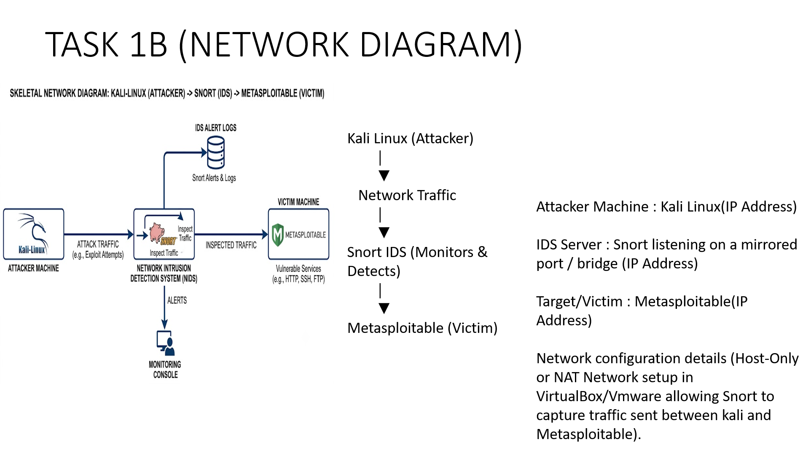

# Lab Setup# Lab Setup & Network Architecture

## Network Topology Diagram

---

## Environment Configuration

### 1. Attacker Machine
* **OS:** Kali Linux
* **Role:** Generates attack traffic (scans, exploits, payload delivery)
* **IP Address:** *(Insert Kali IP here)*

### 2. Intrusion Detection System (IDS)
* **OS:** Ubuntu / Linux
* **Software:** Snort IDS
* **Role:** Captures, inspects, and logs network traffic matching defined rules
* **IP Address:** *(Insert Snort IP here)*

### 3. Victim / Target Machine
* **OS:** Metasploitable
* **Role:** Runs vulnerable services (HTTP, SSH, FTP) to receive traffic
* **IP Address:** *(Insert Metasploitable IP here)*

---

## Network Adapter Setup
* **Hypervisor:** VirtualBox / VMware
* **Network Mode:** Host-Only Adapter / NAT Network
* **Traffic Capture:** Snort configured on a mirrored port or promiscuous interface to monitor traffic flowing between Kali Linux and Metasploitable.